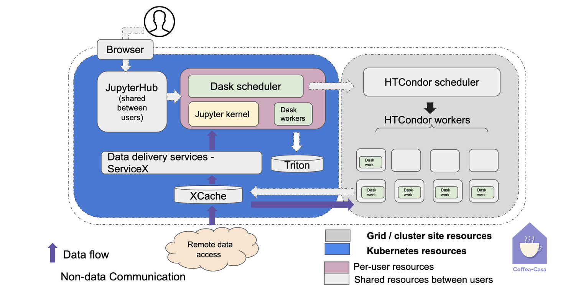

class: middle, center, title-slide
count: false

# Building a Columnar Analysis Demonstrator for ATLAS PHYSLITE Open Data using the Python Ecosystem
.large.blue[Matthew Feickert] 
.large[(University of Wisconsin-Madison)]
 
[matthew.feickert@cern.ch](mailto:matthew.feickert@cern.ch)
 

[International Conference on Computing in High Energy and Nuclear Physics (CHEP) 2024](https://indico.cern.ch/event/1338689/contributions/6015915/)

October 21st, 2024

---
# Self Notes

* Time: 18 minute talk
   - 15 minutes talk
   - 3 minutes questions

---
# Opportunities and Challenges of the HL-LHC
<!--  -->

   
   

<!--  -->
.large[
* Increase in "luminosity" of roughly order of magnitude [FIX THIS SLIDE UP]
   - Factor of .bold[20-25] times the amount of collisions delivered from Run-2 of the LHC
* Boon for measurements constrained by statistical uncertainties, searches for rare processes
]

---
# An Analysis Grand Challenge

.large[
HL-LHC era data scale requires rethinking how we engage with the data when we preform analysis
]

.kol-1-3[
* .bold[Analysis Grand Challenge] (AGC) community exercise organized by [IRIS-HEP](https://iris-hep.org/) includes the stages of a projected typical HL-LHC analysis
* Binned columnar analysis, reinterpretation [fix]
* Development of the required cyberinfrastructure [fix]
* Opportunity for ATLAS to demonstrate how a columnar analysis view and areas for improvement
   - Accessing PHYSLITE, systematics
]
.kol-2-3[

   

.caption[[High level view of operations in an HL-LHC analysis](https://iris-hep.org/grand-challenges.html#analysis-grand-challenge)]
]

---
# Slide describing columnar analysis

Need to add one

---
# ATLAS Open Data

.kol-1-2[
.large[
* Show slide that we have it and go over its use and benefits
]
]
.kol-1-2[
<!-- box-shadow: 5px 5px 15px rgba(0, 0, 0, 0.5); adds a shadow that is 5px to the right and 5px down from the image, with a blur radius of 15px and a semi-transparent black color (rgba(0, 0, 0, 0.5)). -->

   

.caption[13 TeV open data release from ATLAS]
]

---
# Pythonic Analysis Ecosystem

.kol-1-2[

   

.caption[Broader "Scientific Python" ecosystem]
]

Complexity bit goes between two

.kol-1-2[

   

.caption[In [2022](https://indico.cern.ch/event/1140031/) we created a view for the PyHEP ecosystem]
]

---
# Pythonic Ecosystem for ATLAS Analysis

.kol-1-3[
.large[
Providing the elements of an analysis pipeline
 
* Data query and access
* Reading data files (ROOT and others) and columnar access
* Data transformation and histogramming
* Distributed analysis frameworks
* Statistical inference
* Analysis reinterpretation
]
]
.kol-2-3[
 

   

]

---
# Prototyping on US ATLAS Analysis Facilities

.kol-1-3[
.large[
* [University of Chicago Analysis Facility](https://af.uchicago.edu/) .bold[provides testing bed] with Coffea-casa
* Provides support for:
   - JupyterLab as a common interface
   - Highly efficient data delivery with XCache
   - Conversion to columnar formats with ServiceX
* Excellent integration exercise between analysis and operations
]
]
.kol-2-3[

   

.caption[Platform for interactive analysis]
]

---
# Envisioning an ATLAS AGC

Make [slide 3 of this](https://indico.cern.ch/event/1268248/contributions/5326293/attachments/2621545/4532630/2023-03-30%20-%20Analysis%20Demonstrator.pdf) in Inkscape

   
.center.large[Components of an ATLAS AGC demonstrator Pipeline]

---
# Summary

.huge[
* Whirlwind tour
* Not a hopeless bog
]

---
# References

* [Using Legacy ATLAS C++ Calibration Tools in Modern Columnar Analysis Environments](https://indico.cern.ch/event/1330797/contributions/5796636/), Matthias Vigl, [ACAT 2024](https://indico.cern.ch/event/1330797/)
* [How the Scientific Python ecosystem helps answering fundamental questions of the Universe](https://cfp.scipy.org/2024/talk/KCXVVR/), Vangelis Kourlitis, Matthew Feickert, and Gordon Watts, [SciPy 2024](https://www.scipy2024.scipy.org/)
* [The Columnar Analysis Grand Challenge Demonstrator](https://indico.cern.ch/event/1268248/contributions/5326293/), Gordon Watts, [ATLAS S&C Plenary Afternoon: Demonstrators](https://indico.cern.ch/event/1268248/), 2023-10-04 [ATLAS Internal]
* [ATLAS AGC Demonstrator](https://indico.cern.ch/event/1328739/contributions/5605607/), Gordon Watts, [ATLAS AMG+ADC Joint Session](https://indico.cern.ch/event/1328739/), 2023-03-30 [ATLAS Internal]

---
class: end-slide, center

Backup

---
# Thing

.huge[
X
]

---

class: end-slide, center
count: false

The end.
