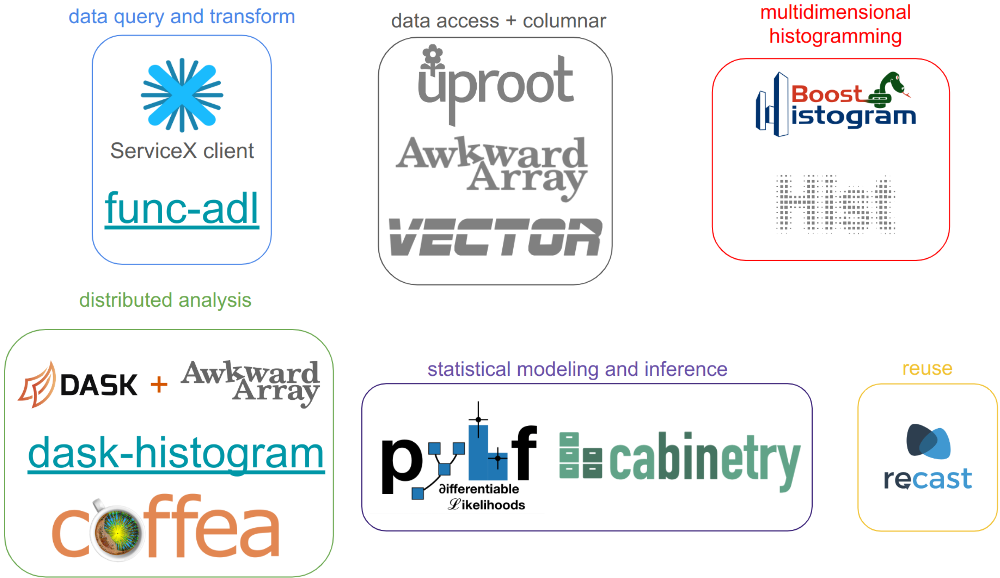

class: middle, center, title-slide
count: false

# Building a Columnar Analysis Demonstrator for ATLAS PHYSLITE Open Data using the Python Ecosystem
.large.blue[Matthew Feickert] 
on behalf of ATLAS Analysis Model Group 
.large[(University of Wisconsin-Madison)]
 
[matthew.feickert@cern.ch](mailto:matthew.feickert@cern.ch)
 

[International Conference on Computing in High Energy and Nuclear Physics (CHEP) 2024](https://indico.cern.ch/event/1338689/contributions/6015915/)

October 21st, 2024

---
# Self Notes (slide will be removed for talk)

* .bold[Time]: 18 minute talk
   - .bold[15 minutes talk]
   - 3 minutes questions
* .bold[Abstract]:
The ATLAS experiment is in the process of developing a columnar analysis demonstrator, which takes advantage of the Python ecosystem of data science tools.
This project is inspired by the analysis demonstrator from IRIS-HEP.
The demonstrator employs PHYSLITE OpenData from the ATLAS collaboration, the new Run 3 compact ATLAS analysis data format.
The tight integration of ROOT features within PHYSLITE presents unique challenges when integrating with the Python analysis ecosystem.
The demonstrator is constructed from ATLAS PHYSLITE OpenData, ensuring the accessibility and reproducibility of the analysis.
The analysis pipeline of the demonstrator incorporates a comprehensive suite of tools and libraries.
These include uproot for data reading, awkward-array for data manipulation, Dask for parallel computing, and hist for histogram processing.
For the purpose of statistical analysis, the pipeline integrates cabinetry and pyhf, providing a robust toolkit for analysis.
.bold[A significant component of this project is the custom application of corrections, scale factors, and systematic errors using ATLAS software.
The infrastructure and methodology for these applications will be discussed in detail during the presentation, underscoring the adaptability of the Python ecosystem for high-energy physics analysis.]

---
# Challenges for Future Analysis

.kol-1-2[
<!-- box-shadow: 5px 5px 15px rgba(0, 0, 0, 0.5); adds a shadow that is 5px to the right and 5px down from the image, with a blur radius of 15px and a semi-transparent black color (rgba(0, 0, 0, 0.5)). -->

   

<!-- .caption[Projected evolution of disk under .blue[conservative] and .red[aggressive] R&D] -->
.center.large[Moving forward won’t be able to store everything on disk]
]
.kol-1-2[

   

.caption[[Jana Schaarschmidt](https://indico.jlab.org/event/459/contributions/11586/), CHEP 2023]

.center.bold[PHYSLITE]
* Common file format for Run 4 Analysis Model
* Contains already-calibrated objects for fast analysis
* Monolithic: Intended to serve ~80% of physics analysis in Run 4
* Directly used without need for ntuples
]

---
# Columnar Analysis

.center.large.bold[
"columnar analysis" == "array programming for data analysis"
]

.kol-1-2[
.large[
* Higher level APIs for new users and improved user experience
   - People using columnar analysis on ntuples already seem to be loving it
   - Enable the same UX but without ntupling (save disk)
* Potential for higher performance
   - Enable on-the-fly CP tool corrections on PHYSLITE
* Broader scientific data analysis ecosystem integration
   - Extend and scale ATLAS tools with large and performant ecosystem
]
]
.kol-1-2[
<!-- box-shadow: 5px 5px 15px rgba(0, 0, 0, 0.5); adds a shadow that is 5px to the right and 5px down from the image, with a blur radius of 15px and a semi-transparent black color (rgba(0, 0, 0, 0.5)). -->

   

.center.large[Different expressions/representations for same analysis result goals]
.caption[([Nick Smith](https://indico.cern.ch/event/759388/contributions/3306852/), [Matthias Vigl](https://indico.cern.ch/event/1340782/contributions/5711534/))]
]

---
# An Analysis Grand Challenge

.large[
HL-LHC era data scale requires rethinking how we engage with the data when we preform analysis
]

.kol-1-3[
* .bold[Analysis Grand Challenge] (AGC) community exercise organized by [IRIS-HEP](https://iris-hep.org/) includes the stages of a projected typical HL-LHC analysis
* Binned columnar analysis, reinterpretation [fix]
* Development of the required cyberinfrastructure [fix]
* Opportunity for ATLAS to demonstrate how a columnar analysis view and areas for improvement
   - Accessing PHYSLITE, systematics
]
.kol-2-3[

   

.caption[[High level view of operations in an HL-LHC analysis](https://iris-hep.org/grand-challenges.html#analysis-grand-challenge)]
]

---
# Pythonic Analysis Ecosystem for HEP

.kol-2-5[

   

.center.huge[Broader "Scientific Python" ecosystem is designed to be interoperable and support [multiple domain levels](https://www.nature.com/articles/s41586-020-2649-2)]
]

.kol-1-5[

   

]

.kol-2-5[

   

.center.huge[Interoperable domain hierarchy design continued in ["PyHEP" ecosystem](https://indico.cern.ch/event/1140031/)]
]

---
# Pythonic Ecosystem for ATLAS Analysis

.kol-1-3[
.large[
Providing the elements of an analysis pipeline
 
* Data query and access
* Reading data files (ROOT and others) and columnar access
* Data transformation and histogramming
* Distributed analysis frameworks
* Statistical inference
* Analysis reinterpretation
]
]
.kol-2-3[
 

   

]

---
# Prototyping on US ATLAS Analysis Facilities

.kol-1-3[
.large[
* [University of Chicago Analysis Facility](https://af.uchicago.edu/) .bold[provides testing bed] with Coffea-casa
* Provides support for:
   - JupyterLab as a common interface
   - Highly efficient data delivery with XCache
   - Conversion to columnar formats with ServiceX
* Excellent integration exercise between analysis and operations
]
]
.kol-2-3[

   

.caption[Platform for interactive analysis]
]

---
# Envisioning an ATLAS AGC

   
.center.large[Components of an ATLAS AGC demonstrator pipeline]

---
# ATLAS Open Data

.kol-1-2[
.large[
* .bold[First] release of [ATLAS Run 2 2015 and 2016 open data](https://atlas.cern/Updates/News/Open-Data-Research) in July 2024
* Using ATLAS open data for AGC
   - Open access data allows for use in testing community projects and problems
   - Released as PHYSLITE (HL-LHC data format)
   - Allows for new students to be able to learn analysis and make contributions quickly
* More on ATLAS Open Data at CHEP 2024:
   - [The First Release of ATLAS Open Data for Research](https://indico.cern.ch/event/1338689/contributions/6013332/) (Zach Marshall, Monday plenary)
   - [Open Data at ATLAS: Bringing TeV collisions to the World](https://indico.cern.ch/event/1338689/contributions/6011129/) (Giovanni Guerrieri, Monday Track 8)
]
]
.kol-1-2[
<!-- box-shadow: 5px 5px 15px rgba(0, 0, 0, 0.5); adds a shadow that is 5px to the right and 5px down from the image, with a blur radius of 15px and a semi-transparent black color (rgba(0, 0, 0, 0.5)). -->

   

<!-- .caption[13 TeV open data release from ATLAS] -->

   

]

---
# Challenges: Reading all PHYSLITE files

.kol-1-2[
.large[
* Raw PHYSLITE is not easily loadable by columnar analysis tools outside of ROOT
* Awkward Array supports [`behaviors`](https://awkward-array.org/doc/2.6/reference/ak.behavior.html), which allow efficiently reinterpreting data on the fly
   - e.g. correctly handling `ElementLinks`
* ATLAS AMG members have contributed [`coffea.nanoevents.PHYSLITESchema`](https://coffeateam.github.io/coffea/api/coffea.nanoevents.PHYSLITESchema.html#coffea.nanoevents.PHYSLITESchema) to support PHYSLITE in Coffea
* Continuing to support fixes to both the PyHEP ecosystem tools as well as reporting issues to PHYSLITE
   - Includes work by [ATLAS IRIS-HEP Fellow Sam Kelson](https://indico.cern.ch/event/1449314/contributions/6101290/)
]
]
.kol-1-2[
 
 

   

]

---
# Summary

.huge[
* Whirlwind tour
* Not a hopeless bog
]

---
# References

* [Using Legacy ATLAS C++ Calibration Tools in Modern Columnar Analysis Environments](https://indico.cern.ch/event/1330797/contributions/5796636/), Matthias Vigl, [ACAT 2024](https://indico.cern.ch/event/1330797/)
* [How the Scientific Python ecosystem helps answering fundamental questions of the Universe](https://cfp.scipy.org/2024/talk/KCXVVR/), Vangelis Kourlitis, Matthew Feickert, and Gordon Watts, [SciPy 2024](https://www.scipy2024.scipy.org/)
* [The Columnar Analysis Grand Challenge Demonstrator](https://indico.cern.ch/event/1268248/contributions/5326293/), Gordon Watts, [ATLAS S&C Plenary Afternoon: Demonstrators](https://indico.cern.ch/event/1268248/), 2023-10-04 [ATLAS Internal]
* [ATLAS AGC Demonstrator](https://indico.cern.ch/event/1328739/contributions/5605607/), Gordon Watts, [ATLAS AMG+ADC Joint Session](https://indico.cern.ch/event/1328739/), 2023-03-30 [ATLAS Internal]

---
class: end-slide, center

Backup

---
# Opportunities and Challenges of the HL-LHC
<!--  -->

   
   

<!--  -->
.large[
* Increase in "luminosity" of roughly order of magnitude [FIX THIS SLIDE UP]
   - Factor of .bold[20-25] times the amount of collisions delivered from Run-2 of the LHC
* Boon for measurements constrained by statistical uncertainties, searches for rare processes
]

---
# Thing

.huge[
X
]

---

class: end-slide, center
count: false

The end.
