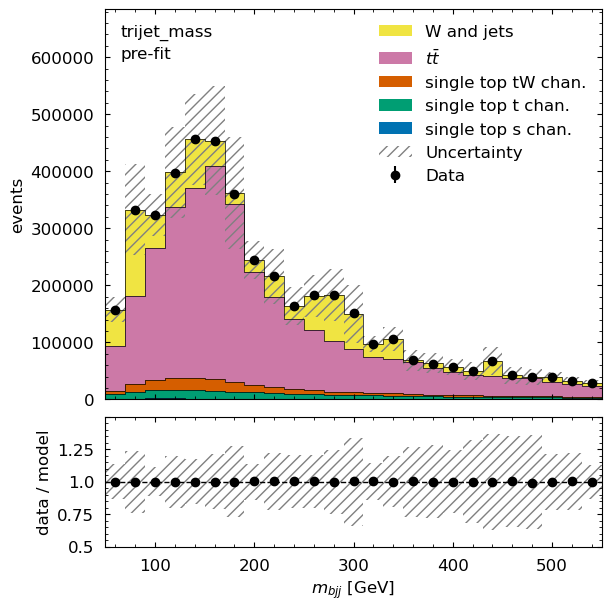

class: middle, center, title-slide
count: false

# Building a Columnar Analysis Demonstrator<br>for ATLAS PHYSLITE Open Data<br>using the Python Ecosystem
KyungEon Choi, .blue[Matthew Feickert], Nikolai Hartmann, Lukas Heinrich, Alexander Held, Evangelos Kourlitis,<br>
Nils Krumnack, Giordon Stark, Matthias Vigl, Gordon Watts on behalf of the .bold[ATLAS Computing Activity]<br>
.large[(University of Wisconsin-Madison)]
<br>
[matthew.feickert@cern.ch](mailto:matthew.feickert@cern.ch)

[International Conference on Computing in High Energy and Nuclear Physics (CHEP) 2024](https://indico.cern.ch/event/1338689/contributions/6015915/)
<br>
October 21st, 2024

.middle-logo[]

---
# Challenges for Future Analysis

.kol-1-2[
<!-- box-shadow: 5px 5px 15px rgba(0, 0, 0, 0.5); adds a shadow that is 5px to the right and 5px down from the image, with a blur radius of 15px and a semi-transparent black color (rgba(0, 0, 0, 0.5)). -->
<p style="text-align:center;">
   <a href="https://cds.cern.ch/record/2802918">
      
   </a>
</p>
.caption[([ATLAS Software and Computing HL-LHC Roadmap](https://cds.cern.ch/record/2802918), 2022)]
.large[
* Won't be able to store everything on disk
* Move towards "trade disk for CPU" model
]
]
.kol-1-2[
<p style="text-align:center;">
   <a href="https://indico.jlab.org/event/459/contributions/11586/">
      
   </a>
</p>
.caption[(Jana Schaarschmidt, [CHEP 2023](https://indico.jlab.org/event/459/contributions/11586/))]

[.center.bold[PHYSLITE]](https://atlas-physlite-content.web.cern.ch/)
* Common file format for .bold[Run 4 Analysis Model]
* Contains already-calibrated objects for fast analysis
* Monolithic: Intended to serve ~80% of physics analysis in Run 4
* Will be able to use directly without need for ntuples
]

---
# Pythonic Ecosystem for ATLAS Analysis

.kol-1-3[
.large[
Providing the elements of a .bold[columnar analysis pipeline]

* Data query and access
* Reading data files (ROOT and others) and columnar access
* Data transformation and histogramming
* Distributed analysis frameworks
* Statistical inference
* Analysis reinterpretation
]
]
.kol-2-3[
<br>
<p style="text-align:center;">
   <a href="https://scikit-hep.org/">
      
   </a>
</p>
]

---
# Composing structure of an ATLAS AGC

.kol-1-5[
<br>
<br>
End user analysis ideally uses .bold[smaller and calibrated PHYSLITE]
<br>
<br>
<br>
<br>
<br>
.bold[Can still use PHYS] (same data format) through will need to perform .bold[additional steps] (calibration) with funcADL
]
.kol-4-5[
<p style="text-align:center;">
   
.center.large[Components of an ATLAS AGC demonstrator pipeline]
</p>
]

---
# Challenges: Reading all PHYSLITE files

.kol-1-2[
.large[
* Raw [PHYSLITE](https://atlas-physlite-content.web.cern.ch/) is not easily loadable by columnar analysis tools outside of ROOT
   - Challenges for correctly handling `ElementLinks` and custom objects .smaller[(e.g. triggers)]
* Awkward Array supports [`behaviors`](https://awkward-array.org/doc/2.6/reference/ak.behavior.html), which allow for efficiently reinterpreting data on the fly
* ATLAS members have contributed to open ecosystem development to support PHYSLITE in both [Uproot](https://uproot.readthedocs.io/en/stable/) and [Coffea](https://coffeateam.github.io/coffea/api/coffea.nanoevents.PHYSLITESchema.html#coffea.nanoevents.PHYSLITESchema)
* Continuing to support fixes to both the PyHEP ecosystem tools as well as reporting issues to PHYSLITE
   - Work by [ATLAS IRIS-HEP Fellow Sam Kelson](https://indico.cern.ch/event/1449314/contributions/6101290/)
]
]
.kol-1-2[
<br>
<br>
<p style="text-align:center;">
   <a href="https://github.com/CoffeaTeam/coffea/issues/1135">
      
   </a>
</p>

* More on ATLAS Open Data at CHEP 2024:
   - [The First Release of ATLAS Open Data for Research](https://indico.cern.ch/event/1338689/contributions/6013332/) <br>(Zach Marshall, Monday plenary)
   - [Open Data at ATLAS: Bringing TeV collisions to the World](https://indico.cern.ch/event/1338689/contributions/6011129/) (Giovanni Guerrieri, Monday Track 8)
]

---
# Challenges: Systematics

.kol-1-2[
.large[
* As columnar analysis .bold[processes events in batches] also need CP tools and algorithms to process in batches
* Current CP tools operate on xAOD event data model (EDM) for calculation and write systematics to disk for future access (I/O heavy)
* Challenge: Can we adapt this model to work in on-the-fly computation columnar paradigm?
   - Help with "trade disk for CPU" model
* Refactoring tools to a columnar backend in ATLAS show .bold[improvements in performance and flexibility]
]
]
.kol-1-2[
<br>
<p style="text-align:center;">
   <a href="https://indico.cern.ch/event/1330797/contributions/5796636/">
      
   </a>
</p>

.center[Columnar .cptools[combined performance (CP) tools] operate on .datacolumn[existing columns] in batches to generate .newcolumn[new columns]<br>(Matthias Vigl, [ACAT 2024](https://indico.cern.ch/event/1330797/contributions/5796636/))]
]

---
# Challenges and Opportunities: Systematics

<p style="text-align:center;">
   <a href="https://indico.cern.ch/event/1330797/contributions/5796636/">
      
   </a>
</p>

.kol-1-2[
.large[
* Refactoring to columnar CP tools has allowed for .bold[more Pythonic] array interfaces to be developed
* Using [next generation](https://nanobind.readthedocs.io/) of C++/Python binding libraries
   <a href="https://nanobind.readthedocs.io/">
      
   </a> allows
   - [Zero-copy operations](https://nanobind.readthedocs.io/en/latest/ndarray.html) to/from $n$-dimensional array libraries in Python that supports GPUs
   - Full design control of high-level user API (unified UX)
]
]
.kol-1-2[
<p style="text-align:center;">
   <a href="https://indico.cern.ch/event/1330797/contributions/5796636/">
      
   </a>
</p>
<p style="text-align:center;">
   <a href="https://indico.cern.ch/event/1330797/contributions/5796636/">
      
   </a>
</p>

.center[Columnar .cptools[combined performance (CP) tools] operate on .datacolumn[existing columns] in batches to generate .newcolumn[new columns]<br>(Matthias Vigl, [ACAT 2024](https://indico.cern.ch/event/1330797/contributions/5796636/))]
]

---
# Columnar CP tools: $Z \to e^{+}e^{-}$ Demo

.kol-1-2[
.large[
Demo of [prototype](https://gitlab.cern.ch/gstark/pycolumnarprototype/-/blob/57ad135c84c4b874f057021f71afaf487cef6a13/Zee_demo.ipynb) (v1) zero-copy Python bindings to columnar Egamma CP tool to compute systematics on the fly for $m_{ee}$.
]

<!--  -->
1. Use [Uproot](https://uproot.readthedocs.io/) to load PHYSLITE Monte Carlo into [Awkward](https://awkward-array.org/) arrays
2. Apply selections with Uproot and [Coffea](https://coffeateam.github.io/coffea/)
3. Initialize tools
```python
from atlascp import EgammaTools
```
4. Compute systematics on the fly efficiently scaled with [dask-awkward](https://dask-awkward.readthedocs.io/) on UChicago ATLAS Analysis Facility

]
.kol-1-2[
<p style="text-align:center;">
   <a href="https://indico.cern.ch/event/1330797/contributions/5796636/">
      
   </a>
</p>

.caption[Selected $m_{ee}$ under on-the-fly computed systematic variations of electron reconstruction efficiency and corrections<br>(Matthias Vigl, [ACAT 2024](https://indico.cern.ch/event/1330797/contributions/5796636/))]
]

---
# Iteratively moving columnar tools forward

.kol-2-3[
.large[
* [v1 prototype](https://gitlab.cern.ch/gstark/pycolumnarprototype/-/blob/57ad135c84c4b874f057021f71afaf487cef6a13/Zee_demo.ipynb) established foundations of what was possible with new tooling
   - Pythonic interfaces to CP tools could be written without heroic levels of work
   - Prototype tools were promising, but more work needed to achieve necessary performance
   - No "zero action" option &mdash; needed to create standalone prototype to determine if work was reasonable
* [v2 prototype](https://gitlab.cern.ch/atlas-asg/columnar-athena) takes a step forward in scope
   - Moves developments into ATLAS Athena and .bold[migrate ATLAS CP tools to columnar backend] without breaking existing workflows
      - Adds thread-safety
   - Adds [infrastructure support](https://gitlab.cern.ch/atlas/atlasexternals/-/merge_requests/1149) for development of columnar analysis tools
   - Allows for full scale integration and performance tests
]
]
.kol-1-3[
<p style="text-align:center;">
   <a href="https://gitlab.cern.ch/gstark/pycolumnarprototype/-/blob/57ad135c84c4b874f057021f71afaf487cef6a13/Zee_demo.ipynb">
      
   </a>
</p>
<br>
<p style="text-align:center;">
   <a href="https://gitlab.cern.ch/atlas-asg/columnar-athena">
      
   </a>
</p>
]

---
# Columnar CP tool backend performance tests

.huge[
* During (ongoing) refactor added preliminary integrated benchmark to measure .bold[time spent in tool per event] (not i/o) and compare to xAOD model
* While direct comparison not possible, tests are as close as possible
   - Only involves `C++` CP tool code (no Python involved)
   - Uses same version of CP tool
   - xAOD includes event store access
* Show .bold[substantial speedups] for migrated tools: .bold[columnar is 2-4x faster] than xAOD interface
   - Time for i/o and connecting columns not included in the performance comparisons (not optimized in the tests, so removed from benchmark)
]

<!--
.center.huge[

| CP Tool                             | Columnar μs/event | | xAOD μs/event | | xAOD/Columnar | |
| --------                            | -------:          | | ---:          | | ---:          | |
| EgammaCalibrationAndSmearingTool    | 2.1               | | 7.1           | | .bold[3.4]    | |
| AsgElectronEfficiencyCorrectionTool | 0.61              | | 2.6           | | .bold[4.3]    | |
| MuonCalibTool                       | 16.8              | | 30.9          | | .bold[1.8]    | |
| MuonEfficiencyScaleFactors          | 0.42              | | 2.6           | | .bold[6.2]    | |
| JetUncertaintiesTool                | 3.4               | | 14.9          | | .bold[4.4]    | |

]
 -->

---
# Challenges: Tooling design decisions

.large[
* ATLAS CP tools were created 10-15 years ago to .bold[run in an analysis framework]
   - Battle tested, extremely well understood, excellent physics performance, strong desire to be be maintained
   - Rewrite cost is currently too high across collaboration to move to [`correctionlib`](https://cms-nanoaod.github.io/correctionlib/) paradigm
   - Legacy code decisions highlight columnar prototype design decisions and opportunities during tool migration
   - Columnar .bold[cracks open "black box"] implementations of tools for the new analysis model
* Raises the question: "What would it take to get to .bold[`python -m pip install atlascp`]?"
   - Ambitious idea not as far fetched as you might think: [`pip install ROOT`](https://indico.cern.ch/event/1338689/contributions/6010410/) (Vincenzo Padulano, Monday Track 6)
* Columnar prototype explores these possibilities
   - .bold[Adopting columnar backend] makes columnar paradigm possible
   - .bold[Ongoing `nanobind` integration] bridges `C++`/Python with performance
   - .bold[Pythonic API design] for high level analysis thinking
* Steps beyond: Modularization to level that allows packaging with [`scikit-build-core`](https://scikit-build-core.readthedocs.io/)
   - Allows for "just another" tool in the PyHEP ecosystem
]

---
# ATLAS Open Data AGC Implementations

.kol-1-2[
.large[
* Tooling ecosystem is proving .bold[approachable and performant] for Pythonic columnar analysis of PHYSLITE
* Enabling mentored university students to implement versions of the AGC by themselves in a Jupyter notebook
* ATLAS IRIS-HEP Fellow Denys Klekots's [AGC project using .bold[ATLAS open data]](https://indico.cern.ch/event/1455396/contributions/6126406/) ([implementation on GitHub](https://github.com/iris-hep/agc-physlite))
* Simplified version of [IRIS-HEP AGC top reconstruction challenge](https://agc.readthedocs.io/) using 2025+2016 Run 2 Monte Carlo from the 2024 .bold[ATLAS open data] release
]
]
.kol-1-2[
.bold[Event selection]
* 1 charged lepton
* $\geq 4$ hadronic jets
* Lepton kinematics: $p_{T} \geq 30~\mathrm{GeV}$, $\left|\eta\right| < 2.1$
* Jet kinematics: $p_{T} \geq 25~\mathrm{GeV}$, $\left|\eta\right| < 2.4$

<p style="text-align:center;">
   <a href="https://indico.cern.ch/event/1455396/contributions/6126406/">
      
   </a>
   <a href="https://indico.cern.ch/event/1455396/contributions/6126456/">
      
   </a>
</p>
.center.large.bold[ATLAS open data]
]

---
# Summary of ATLAS Columnar AGC Efforts

.huge[
* Columnar analysis tool efforts inside of ATLAS have been promising with CP tools showing performance increases and bespoke UI
* Development of a columnar ATLAS AGC demonstrator with full systematics is ongoing supported by advancements in v2 prototype
* Technical advancements are being incorporated into ATLAS wide tooling
* Contributions upstream to PyHEP community tools
* ATLAS Open Data proving to be useful for research and community communication
* Advancements in tooling are enabling researchers across career stages
]

---
# Acknowledgements

.huge[This work was supported in part by the United States National Science Foundation under Cooperative Agreements [OAC-1836650](https://nsf.gov/awardsearch/showAward?AWD_ID=1836650) and <br>[PHY-2323298](https://nsf.gov/awardsearch/showAward?AWD_ID=2323298) (Institute for Research and Innovation in Software for High Energy Physics (IRIS-HEP)).]

<p style="text-align:center;">
   <a href="https://iris-hep.org/">
      
   </a>
</p>

---
class: end-slide, center

.huge[Backup]

---
# Columnar Analysis

.center.large.bold[
"columnar analysis" == "array programming for data analysis"
]

.kol-1-2[
.large[
* Higher level APIs for physicists and improved user experience
   - People using columnar analysis on ntuples already seem to be loving it
   - Enable the same UX but without ntupling (save disk)
* Potential for higher performance
   - Enable on-the-fly combined performance (CP) tool corrections on PHYSLITE
* Broader scientific data analysis ecosystem integration
   - Extend and scale ATLAS tools with large and performant ecosystem
]
]
.kol-1-2[
<!-- box-shadow: 5px 5px 15px rgba(0, 0, 0, 0.5); adds a shadow that is 5px to the right and 5px down from the image, with a blur radius of 15px and a semi-transparent black color (rgba(0, 0, 0, 0.5)). -->
<p style="text-align:center;">
   <a href="https://indico.cern.ch/event/1340782/contributions/5711534/">
      
   </a>
</p>

.center.large[Different expressions/representations for same analysis result goals]
.caption[(Nick Smith, [2019 Joint HSF/OSG/WLCG Workshop](https://indico.cern.ch/event/759388/contributions/3306852/))]
]

---
# An Analysis Grand Challenge

.large.center[
HL-LHC era data scale requires rethinking interacting with data during analysis
]

.kol-2-5[
.large[
* .bold[Analysis Grand Challenge] (AGC) community exercise organized by [IRIS-HEP](https://iris-hep.org/) includes the stages of a projected typical HL-LHC analysis
* Demonstrator of development of the required cyberinfrastructure
   - [The 200Gbps Challenge: Imagining HL-LHC analysis facilities](https://indico.cern.ch/event/1338689/contributions/6009824/) (Alexander Held, Monday plenary)
* Opportunity for ATLAS to demonstrate columnar analysis views and areas for improvement
]
]
.kol-3-5[
<p style="text-align:center;">
   <a href="https://iris-hep.org/grand-challenges.html#analysis-grand-challenge">
      
   </a>
</p>

.center.large[[High level view of operations in an HL-LHC analysis](https://iris-hep.org/grand-challenges.html#analysis-grand-challenge)]
]

---
# Pythonic Analysis Ecosystem for HEP

.kol-2-5[
<p style="text-align:center;">
   <a href="https://web.archive.org/web/20200925025947/https://coiled.io/blog/pydata-dask/">
      
   </a>
</p>

.center.huge[Broader "Scientific Python" ecosystem is designed to be interoperable and support [multiple domain levels](https://www.nature.com/articles/s41586-020-2649-2)]
]

.kol-1-5[
<p style="text-align:center;">
   
</p>
]

.kol-2-5[
<p style="text-align:center;">
   <a href="https://indico.cern.ch/event/1140031/">
      
   </a>
</p>

.center.huge[Interoperable domain hierarchy design continued in ["PyHEP" ecosystem](https://indico.cern.ch/event/1140031/)]
]

---
# Prototyping on US ATLAS Analysis Facilities

.kol-1-3[
.large[
* [University of Chicago Analysis Facility](https://af.uchicago.edu/) .bold[provides testing bed] for analysis platform
* Provides support for:
   - [.bold[JupyterLab]](https://jupyterlab.readthedocs.io/) as a common interface
   - Highly efficient data delivery with [.bold[XCache]](https://slateci.io/XCache/)
   - Conversion to columnar formats with [.bold[ServiceX]](https://iris-hep.org/projects/servicex.html)
* Excellent integration exercise between analysis and operations
]
]
.kol-2-3[
<p style="text-align:center;">
   <a href="https://iris-hep.org/projects/coffea-casa.html">
      
   </a>
</p>

.center.large[Scalable platform for interactive (or noninteractive) analysis]
]

---
# ATLAS Open Data

.kol-1-2[
.large[
* .bold[First] release of [ATLAS Run 2 2015 and 2016 open data](https://atlas.cern/Updates/News/Open-Data-Research) in July 2024
* Using ATLAS open data for AGC
   - Open access data allows for use in testing community projects and problems
   - Released as PHYSLITE (HL-LHC data format)
   - Allows for new students to be able to learn analysis and make contributions quickly
* More on ATLAS Open Data at CHEP 2024:
   - [The First Release of ATLAS Open Data for Research](https://indico.cern.ch/event/1338689/contributions/6013332/) (Zach Marshall, Monday plenary)
   - [Open Data at ATLAS: Bringing TeV collisions to the World](https://indico.cern.ch/event/1338689/contributions/6011129/) (Giovanni Guerrieri, Monday Track 8)
]
]
.kol-1-2[
<!-- box-shadow: 5px 5px 15px rgba(0, 0, 0, 0.5); adds a shadow that is 5px to the right and 5px down from the image, with a blur radius of 15px and a semi-transparent black color (rgba(0, 0, 0, 0.5)). -->
<p style="text-align:center;">
   <a href="https://atlas.cern/Updates/News/Open-Data-Research">
      
   </a>
</p>
.center[([ATLAS News, 2024-07-01](https://atlas.cern/Updates/News/Open-Data-Research))]
<!-- .caption[13 TeV open data release from ATLAS] -->
<p style="text-align:center;">
   <a href="https://atlas.cern/Updates/News/Open-Data-Research">
      
   </a>
</p>
]

---
# References

* [ATLAS Software and Computing HL-LHC Roadmap](https://cds.cern.ch/record/2802918), ATLAS Collaboration, 2022
* [ATLAS PHYSLITE Content Documentation](https://atlas-physlite-content.web.cern.ch/), ATLAS Collaboration, Accessed 2024
* [Using Legacy ATLAS C++ Calibration Tools in Modern Columnar Analysis Environments](https://indico.cern.ch/event/1330797/contributions/5796636/), Matthias Vigl, [ACAT 2024](https://indico.cern.ch/event/1330797/)
* [How the Scientific Python ecosystem helps answering fundamental questions of the Universe](https://cfp.scipy.org/2024/talk/KCXVVR/), Vangelis Kourlitis, Matthew Feickert, and Gordon Watts, [SciPy 2024](https://www.scipy2024.scipy.org/)
* [The Columnar Analysis Grand Challenge Demonstrator](https://indico.cern.ch/event/1268248/contributions/5326293/), Gordon Watts, [ATLAS S&C Plenary Afternoon: Demonstrators](https://indico.cern.ch/event/1268248/), 2023-10-04 [ATLAS Internal]
* [ATLAS AGC Demonstrator](https://indico.cern.ch/event/1328739/contributions/5605607/), Gordon Watts, [ATLAS AMG+ADC Joint Session](https://indico.cern.ch/event/1328739/), 2023-03-30 [ATLAS Internal]
* [Tour of the CP Columnar Prototype and CP Algorithm Conversion](https://indico.cern.ch/event/1463263/contributions/6161076/), Nils Krumnack, 2024-10-07 [ATLAS Internal]
